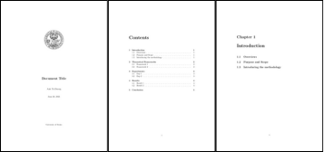

# LaTeX Report Template
A simple LaTeX template for creating document.



## How to Use

#### 1. Configure Document Info:
Edit `config.tex` to set the title, author, and other details of your document.

```tex
\newcommand{\doctitle}{Your Document Title}
\newcommand{\docauthor}{Your Name}
```

#### 2. Set PDF Filename:
Open the `Makefile` and change `DOC_NAME` and `VERSION` to define the output filename.

```makefile
DOC_NAME = Report_Title
VERSION  = v1
```

#### 3. Write Content:
Add your text to the `.tex` files in the `sections/` directory. Images will be placed in `figures/` directory.

#### 4. Build:
Run the following command in your terminal to compile the PDF.

```bash
make
```

### Commands

- `make`: Builds the document and creates the final PDF.

- `make clean`: Removes all generated files, including the PDF and build directory.